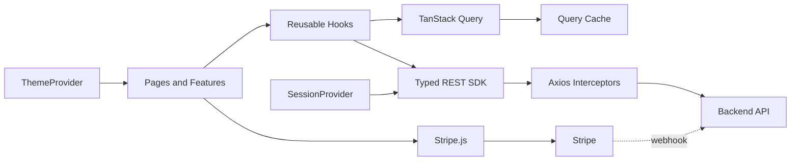

# Admin Dashboard + Marketplace

Aplicación React + TypeScript con dos caras: un **panel administrativo** (usuarios, roles, permisos, categorías, cupones, moderación de productos y preferencias visuales) y una **tienda tipo marketplace** donde los usuarios publican sus productos, compran con carrito y pagan con Stripe. Está construida alrededor de un SDK REST tipado, hooks reutilizables de React Query y un pipeline de calidad que bloquea el build y los commits cuando el código no cumple las reglas.

## En una mirada

| Área | Decisión |
| --- | --- |
| Runtime | React 18 + React DOM |
| Bundler | Vite 7 + SWC |
| Lenguaje | TypeScript 5 con `strict` habilitado |
| Routing | Generouted + React Router |
| Server state | TanStack React Query |
| Estado local | Recoil y Context API |
| HTTP | Axios detrás de un SDK propio |
| Validación | Zod + React Hook Form |
| Pagos | Stripe (`@stripe/stripe-js`, `@stripe/react-stripe-js`) |
| UI | Componentes propios, Tailwind CSS y Lucide |
| Feedback | React Toastify |
| Calidad | ESLint, Prettier, Husky y lint-staged |
| Package manager | pnpm |

## Capacidades

**Cuenta y sesión**
- Inicio de sesión, registro, consulta de perfil y cierre de sesión.
- Persistencia de token y refresh token en `localStorage`.
- Renovación automática del access token ante respuestas `401`.
- Redirección tras iniciar sesión según el rol: admins al panel, el resto a la tienda.

**Tienda (marketplace)**
- Catálogo público con búsqueda, filtro por categoría (árbol de categorías y subcategorías) y paginación sincronizada con la URL.
- Detalle de producto con galería, variantes (talla, color, etc.) y stock.
- Carrito, cupones de descuento y checkout con Stripe.
- Historial de compras, cancelación de pedidos pendientes y reintento de pago.
- Cada usuario publica y administra **sus propios productos** (imágenes, categoría y variantes) y ve sus ventas.
- Un usuario **no puede comprar sus propios productos**: el botón se bloquea en el detalle y el backend lo valida de nuevo.

**Panel administrativo**
- Gestión CRUD de usuarios, roles y permisos.
- Gestión de categorías (dos niveles) y cupones.
- Moderación de productos de cualquier vendedor (rol `SUPER_ADMIN` o permiso `MANAGE_PRODUCTS`).
- Tema claro/oscuro con detección de preferencia del sistema y personalización de colores.

**Transversal**
- Búsqueda, paginación y consultas remotas mediante hooks genéricos.
- Control de acceso por rol y pantalla de acceso no autorizado.
- Componentes reutilizables para tablas, formularios, modales, selects remotos, subida de imágenes, badges, toolbar y navegación.
- Manejo centralizado de errores HTTP, sesión expirada y permisos insuficientes.

## Arranque local

### Requisitos

- Node.js compatible con Vite 7.
- pnpm habilitado.
- El backend del marketplace en ejecución (autenticación, CRUD, productos, carrito, pedidos y webhook de Stripe).
- Cuenta de Stripe en modo test.

### Instalación

```bash
pnpm install
```

Las librerías de Stripe son las únicas propias del ecommerce:

```bash
pnpm add @stripe/stripe-js @stripe/react-stripe-js
```

### Variables de entorno

Crea un archivo `.env.local` en la raíz:

```dotenv
# Origen del backend (el código agrega /api)
VITE_API_SERVICE=http://localhost:3000

# Clave para cifrar el estado persistido en localStorage
VITE_SECRET_KEY=valor-de-configuracion-local

# Clave PÚBLICA de Stripe (pk_test_...), del mismo sandbox que el STRIPE_SECRET_KEY del backend
VITE_STRIPE_PUBLISHABLE_KEY=pk_test_

# Opcional: moneda para mostrar precios. Default USD; debe coincidir con STRIPE_CURRENCY del backend
# VITE_CURRENCY=USD
```

| Variable | Uso |
| --- | --- |
| `VITE_API_SERVICE` | Origen del backend. Obligatoria. |
| `VITE_SECRET_KEY` | Cifra los datos persistidos por `useRecoilStorage`. Obligatoria. |
| `VITE_STRIPE_PUBLISHABLE_KEY` | Clave pública de Stripe. Sin ella, la pantalla de pago muestra un aviso de configuración. |
| `VITE_CURRENCY` | Moneda de `formatMoney`. Default `USD`. |

> Importante: cualquier variable `VITE_*` forma parte del bundle del navegador. `VITE_SECRET_KEY` no debe tratarse como un secreto criptográfico ni como una frontera de seguridad. La clave **secreta** de Stripe (`sk_...`) nunca va en el frontend. La autorización real vive en el backend; el cifrado local solo protege el estado frente a una lectura casual del storage.

Vite lee el `.env` solo al arrancar: reinicia `pnpm dev` después de cambiarlo. Además, el backend debe incluir el origen del front (por ejemplo `http://localhost:5173`) en su `CORS_ORIGINS`.

### Scripts

| Comando | Uso |
| --- | --- |
| `pnpm dev` | Inicia Vite en modo desarrollo. |
| `pnpm build` | Ejecuta tipos, ESLint, Prettier y genera `dist`. |
| `pnpm preview` | Sirve localmente el build generado. |
| `pnpm lint` | Ejecuta type-check, ESLint sin warnings y Prettier check. |
| `pnpm lint:fix` | Corrige ESLint y formatea TypeScript. |
| `pnpm check-types` | Ejecuta `tsc --noemit`. |
| `pnpm eslint` | Ejecuta ESLint con cache y `--max-warnings=0`. |
| `pnpm prettier:check` | Comprueba el formato sin modificar archivos. |
| `pnpm prettier:fix` | Aplica el formato Prettier. |

## Flujo de trabajo y commits

El flujo recomendado es deliberadamente explícito:

```bash
pnpm lint:fix
git add .
git commit -m "feat: update users table"
```

El hook `.husky/pre-commit` vuelve a ejecutar, en orden:

```bash
pnpm lint:fix && pnpm lint-staged && pnpm lint
```

Si ESLint, Prettier, TypeScript o cualquier validación falla, Git cancela el commit y deja visibles los errores.

El hook `.husky/commit-msg` exige el formato `tipo: descripción`. Tipos permitidos:

```text
feat, fix, update, docs, style, refactor, test, chore, build, ci, perf, revert
```

Ejemplos:

```text
feat: add role filters
fix: handle expired refresh token
refactor: simplify user service
```

## Arquitectura

La aplicación separa transporte, estado remoto, sesión y presentación:



### Composición de la aplicación

El punto de entrada es `src/main.tsx`. La composición principal queda así:

```text
RecoilRoot
└── QueryClientProvider
    └── ToastContainer
        └── ThemeProvider
            └── SessionProvider
                └── AppShell
                    └── Generated Routes
```

- `RecoilRoot` habilita el estado global.
- `QueryClientProvider` centraliza cache y consultas HTTP.
- `ThemeProvider` aplica tema y variables CSS.
- `SessionProvider` mantiene sesión, perfil y mutaciones de auth.
- `AppShell` renderiza el outlet y el selector global de tema.

### Estructura del código

```text
src/
├── api/                         # Servicios concretos de dominio
│   ├── index.ts                 # Instancias exportadas de todos los servicios
│   └── custom/                  # UserService, ProductService, CategoryService,
│                                # CartService, OrderService, UploadService
├── components/
│   ├── guards/                  # RequireAuth, RequireGuest, ProtectedRoute
│   └── ui/                      # Button, Table, Modal, forms, ImageDropzone,
│                                # SelectApi, QuantityStepper, Badge, etc.
├── config/
│   ├── dashboardMenu.ts         # Navegación del panel
│   └── queryClient.ts           # QueryClient y query keys
├── constants/                   # Estado persistente y constantes globales
├── context/                     # SessionContext y ThemeContext
├── enum/                        # Roles y rutas centralizadas
├── features/
│   ├── AppShell.tsx
│   ├── account/                 # Layout de "Mi cuenta" (compras, productos, ventas)
│   ├── cart/                    # Carrito y cupones
│   ├── categories/              # Listado y formulario (dashboard)
│   ├── checkout/                # Pago con Stripe, resultado y resumen
│   ├── coupons/                 # Listado y formulario (dashboard)
│   ├── orders/                  # Mis compras
│   ├── permissions/             # Listado y formulario de permisos
│   ├── products/                # Gestión de productos, formulario y variantes
│   ├── roles/                   # Listado y formulario de roles
│   ├── sales/                   # Mis ventas
│   ├── settings/                # Configuración visual
│   ├── store/                   # Catálogo, tarjeta, detalle y layout de la tienda
│   └── users/                   # Listado y formulario de usuarios
├── hooks/
│   ├── core/                    # Hooks de queries, CRUD y storage
│   ├── useCart.ts               # Carrito activo y sus mutaciones
│   ├── useSession.ts
│   └── useTheme.ts
├── lib/                         # Color, dinero, imágenes, productos, rutas,
│                                # estados de pedido, Stripe e idempotencia
├── models/
│   ├── app/                     # Menú, tema, sesión y media
│   └── entities/                # User, Role, Permissions, Product, Category,
│                                # Cart, Coupon, Order, Upload
├── pages/                       # Rutas detectadas por Generouted
├── schemas/                     # Esquemas Zod de formularios
├── sdk/                         # Cliente REST genérico y contratos de respuesta
├── styles/                      # CSS global y variables de tema
├── types/                       # Declaraciones para Vite y Axios
└── utils/                       # Normalización de errores y helpers
```

## Routing y acceso

Las rutas se generan desde `src/pages`.

### Tienda y cuenta

| Ruta | Propósito | Acceso |
| --- | --- | --- |
| `/` | Catálogo de productos (filtros `search`, `category`, `page` en la URL). | Público |
| `/products/:id` | Detalle, variantes y "Agregar al carrito". | Público |
| `/cart` | Carrito, cupón y botón de pago. | Sesión |
| `/checkout?order=:id` | Pago con Stripe. | Sesión |
| `/checkout/result?order=:id` | Resultado del pago (consulta el estado del pedido). | Sesión |
| `/account` | Redirige a `/account/orders`. | Sesión |
| `/account/orders` | Mis compras, cancelar o reintentar el pago. | Sesión |
| `/account/products` | Mis productos: crear, editar, eliminar y restaurar. | Sesión |
| `/account/sales` | Lo que he vendido (pedidos ya pagados). | Sesión |

### Autenticación

| Ruta | Propósito |
| --- | --- |
| `/login` | Inicio de sesión para visitantes. |
| `/signup` | Registro de usuario (el backend asigna el rol `USER`). |
| `/unauthorized` | Respuesta para acceso no autorizado. |

### Panel administrativo

| Ruta | Propósito | Restricción |
| --- | --- | --- |
| `/dashboard` | Redirect al listado de usuarios. | Sesión |
| `/dashboard/users` | Administración de usuarios. | Sesión (el backend aplica permisos) |
| `/dashboard/products` | Moderación: todos los productos, con vendedor. | Sesión (el backend exige `MANAGE_PRODUCTS` o `SUPER_ADMIN`) |
| `/dashboard/categories` | Categorías y subcategorías. | Sesión (el backend exige permisos de categoría) |
| `/dashboard/coupons` | Cupones de descuento. | Sesión (el backend exige permisos de cupón) |
| `/dashboard/roles` | Administración de roles. | `ADMIN` o `SUPER_ADMIN` |
| `/dashboard/permissions` | Administración de permisos. | `ADMIN` o `SUPER_ADMIN` |
| `/dashboard/settings` | Tema y personalización visual. | `ADMIN` o `SUPER_ADMIN` |

Las rutas desconocidas redirigen a `/`.

Los guards se dividen por responsabilidad:

- `RequireAuth`: redirige a `/login` si no existe token.
- `RequireGuest`: impide que una sesión activa vuelva a login o registro (la envía a `/`).
- `ProtectedRoute`: valida si el rol actual aparece en la lista permitida.

Tras iniciar sesión, `homeRouteFor(rol)` (en `lib/routes.ts`) decide el destino: `ADMIN` y `SUPER_ADMIN` van a `/dashboard`; cualquier otro rol va a `/`.

`src/router.ts` es generado por Generouted. No debe editarse manualmente: cualquier cambio será sobrescrito por el generador, y se regenera solo con `pnpm dev` o `pnpm build`.

## Flujos del marketplace

### Publicar un producto

Desde `/account/products` → **Nuevo producto** (`ProductForm`):

1. Se completan nombre, descripción y categoría (select remoto con el formato "Categoría › Subcategoría").
2. Se eligen entre 1 y 10 imágenes; la primera es la principal.
3. Se agregan una o más variantes (SKU, precio, stock y atributos como Talla o Color).
4. Al guardar, las imágenes nuevas se suben primero a `/uploads/many` y el producto se envía con las relaciones como `{ id }` y `[{ id }]`:

```json
{
  "name": "Camiseta básica",
  "description": "100% algodón",
  "category": { "id": 3 },
  "images": [{ "id": 10 }, { "id": 11 }],
  "variants": [
    { "sku": "CAM-M-ROJO", "price": 19.99, "stockQuantity": 25, "attributes": { "Talla": "M", "Color": "Rojo" } }
  ]
}
```

Al **editar**, las variantes se guardan al instante contra `/products/:id/variants` (alta, edición y baja); el resto del formulario se guarda con el botón Guardar. Un producto siempre conserva al menos una variante. La edición no envía variantes en el `PUT` del producto.

### Comprar

1. En el detalle se elige la variante y la cantidad (limitada por el stock) y se agrega al carrito. En productos propios el botón se desactiva.
2. En `/cart` se puede cambiar cantidades, aplicar un cupón y pagar.
3. **Pagar** llama a `POST /orders/checkout`. El backend reserva el stock, crea el pedido en `pending_payment` y devuelve `{ order, clientSecret }`.
4. `/checkout?order=:id` monta el `PaymentElement` de Stripe con ese `clientSecret` y confirma el pago.
5. `/checkout/result` consulta el pedido hasta que el webhook lo marque como `paid` o `cancelled`.

Detalles que conviene conocer:

- **El pago se confirma por webhook, no por el navegador.** La pantalla de resultado nunca da un pedido por pagado por sí sola: consulta al backend y repite la consulta mientras siga `pending_payment`.
- **Idempotencia.** `CartPage` genera una `Idempotency-Key` (UUID) la primera vez que se pulsa Pagar y la reutiliza si la respuesta se pierde o el servidor falla, para que un reintento no cree un pedido duplicado. La clave se descarta ante un error 4xx o tras un checkout exitoso.
- **Conflictos (409).** Si cambió el precio, el stock o el cupón, se muestra el mensaje y se recarga el carrito para revisarlo.
- **Retomar el pago.** El backend solo entrega el `clientSecret` al crear el pedido, así que se guarda en `sessionStorage` (`lib/pendingCheckout.ts`) para poder continuar si el usuario recarga la página. Si no existe, se vuelve al carrito.
- **Total 0.** Con un cupón del 100% el pedido queda pagado sin pasar por Stripe y se va directo al resultado.
- **Cancelación.** Desde `/account/orders` se puede cancelar un pedido `pending_payment`; el backend devuelve el stock. Los pedidos sin pagar también expiran por tiempo en el servidor.

### Probar pagos en local

El backend necesita recibir el webhook de Stripe. Con el backend corriendo:

```bash
stripe listen --events payment_intent.succeeded,payment_intent.canceled,payment_intent.payment_failed --forward-to localhost:3000/api/payments/stripe/webhook
```

Pega el `whsec_...` que imprime en `STRIPE_WEBHOOK_SECRET` del backend. Paga con la tarjeta de prueba `4242 4242 4242 4242` (cualquier fecha futura y CVC). La `pk_test_` del front y la `sk_test_` del backend deben ser del mismo sandbox.

### Moderación

Un usuario con rol `SUPER_ADMIN` o con el permiso `MANAGE_PRODUCTS` puede, desde `/dashboard/products`, buscar cualquier producto y editarlo o eliminarlo. La pantalla es la misma que "Mis productos", con alcance distinto (`ProductsManager` con `scope="mine" | "all"`). Limitación: el catálogo no lista productos eliminados, así que no se pueden restaurar productos ajenos desde la interfaz.

## SDK REST

`src/sdk/core/Service.ts` expone una abstracción genérica para entidades que extienden `BaseEntity`:

```ts
findAll(params)              // GET collection
findById(params)             // GET collection/:id
findBy(params)               // GET custom path
create(params)               // POST collection
update(params)               // PUT collection/:id
delete(params)               // DELETE collection/:id
restore(params)              // PATCH collection/:id/restore
```

Los servicios exportados desde `src/api/index.ts`:

```ts
export const userService = new UserService()
export const productService = new ProductService()
export const categoryService = new CategoryService()
export const cartService = new CartService()
export const orderService = new OrderService()
export const uploadService = new UploadService()

export const roleService = new Service<Role>({ endpoint: 'roles' })
export const permissionService = new Service<Permissions>({ endpoint: 'permissions' })
export const couponService = new Service<Coupon>({ endpoint: 'coupons' })
export const saleService = new Service<Sale>({ endpoint: 'orders/sales' })
```

Los servicios con endpoints especiales extienden el base:

| Servicio | Añade |
| --- | --- |
| `UserService` | `POST /auth/login`, `POST /auth/signup`, `GET /auth/profile`, `POST /auth/logout` |
| `ProductService` | Alta, edición y baja de variantes: `/products/:id/variants[/:variantId]` |
| `CategoryService` | `GET /categories/tree` (árbol completo) |
| `CartService` | Carrito, items y cupón: `/cart`, `/cart/items[/:itemId]`, `/cart/coupon` |
| `OrderService` | `POST /orders/checkout` (con `Idempotency-Key`) y `POST /orders/:id/cancel` |
| `UploadService` | `POST /uploads`, `POST /uploads/many` |

Para listar solo los productos del usuario, `useFindAll` acepta un `endpoint` que sobrescribe el del servicio (`products/mine`).

### Interceptores Axios

`AxiosConfig` crea una instancia con timeout de 60 segundos y aplica:

- `Authorization: Bearer <token>` cuando existe access token.
- Eliminación de `Content-Type` para payloads `FormData` y boundary automático del navegador.
- Renovación concurrente controlada del token mediante una única `refreshPromise`.
- Tratamiento centralizado de `401` y `403` (con la opción `onForbidden` por petición para flujos que manejan el 403 ellos mismos).
- Limpieza de tokens, cache de sesión y redirección a login cuando la sesión expira.

## Estado y fetching

### React Query

`src/config/queryClient.ts` define los defaults globales:

```ts
refetchOnWindowFocus: false
retry: false
staleTime: 5 minutos
gcTime: 30 minutos
```

Las claves compartidas son `session`, `users`, `roles`, `permissions`, `cart`, `products`, `categories`, `coupons`, `orders` y `sales`.

Los hooks genéricos evitan duplicar lógica:

- `useFindAll`: listado paginado con cache y parámetros serializados.
- `useInfiniteFindAll`: consultas paginadas con scroll infinito.
- `useCrud`: create, update, delete, restore y consultas puntuales por id/path.
- `useQueryParams`: sincroniza filtros permitidos con la URL.
- `useCart`: carrito activo del usuario. Todas sus mutaciones (agregar, cambiar cantidad, quitar, vaciar, aplicar/quitar cupón) devuelven el carrito actualizado y lo escriben en la cache.

Las mutaciones invalidan automáticamente la query key asociada después de una operación exitosa.

### Recoil y persistencia

`useRecoilStorage` combina Recoil, Zod y CryptoJS para persistir estado validado en `localStorage`. Actualmente se utiliza para el estado de búsqueda del dashboard.

El tema se persiste por separado mediante `ThemeProvider`:

- `theme`: modo `light` o `dark`.
- `theme-colors`: paletas personalizadas para ambos modos.

El `clientSecret` pendiente de pago vive en `sessionStorage` (ver [Comprar](#comprar)).

## Formularios y dominio

Los formularios usan React Hook Form y Zod:

- `schemas/auth.ts`: login y registro. `confirmPassword` solo se valida en el front y **no se envía** al backend, que rechaza propiedades desconocidas.
- `schemas/user.ts`, `schemas/role.ts`, `schemas/permission.ts`: usuarios, roles y permisos.
- `schemas/product.ts`: producto (nombre, descripción, categoría, entre 1 y 10 imágenes) y variantes.
- `schemas/category.ts`, `schemas/coupon.ts`: categorías y cupones.

Las entidades principales:

```ts
User        // username, name, surname, email, blocked, role
Role        // active, permissions
Permissions // name, title
Product     // name, description, category, seller, images, variants
Category    // name, description, parent (null = categoría raíz)
Cart        // items, cupón y totales
Coupon      // code, discountType (percentage | fixed), discountValue, expirationDate
Order       // status, subtotal, discountTotal, total, items (snapshot del producto)
```

Todas se integran con el contrato base del SDK mediante `BaseEntity`. Las relaciones se envían al backend como `{ id: number }` (objeto) o `[{ id: number }]` (lista), nunca como un id suelto.

Los estados de un pedido y su etiqueta visual viven en `lib/orderStatus.ts`: `pending_payment` (advertencia), `paid` (éxito) y `cancelled` (neutro). Los importes se formatean con `formatMoney` (`lib/money.ts`).

## UI y tema

La UI vive principalmente en `src/components/ui` y `src/styles`.

- Tailwind CSS se usa para composición y estados locales.
- `src/styles/index.css` define variables y estilos globales.
- `ThemeProvider` aplica las variables al elemento raíz mediante `data-theme`.
- `ColorField` y `SettingsPage` permiten cambiar colores y restaurar paletas.
- `ImageDropzone` (arrastrar, reordenar y límite de archivos), `ImageWithBlurHash` (placeholder mientras carga), `QuantityStepper` y `SelectApi` (select con búsqueda remota) son los componentes del ecommerce.
- Lucide proporciona iconos consistentes en navegación y acciones.
- `react-toastify` muestra feedback transversal de sesión y errores HTTP.

## Crear un nuevo módulo CRUD

1. Define la entidad en `src/models/entities` extendiendo `BaseEntity`.
2. Añade el servicio en `src/api/index.ts` o extiende `Service` para endpoints especiales.
3. Registra una query key en `src/config/queryClient.ts`.
4. Crea los esquemas Zod necesarios en `src/schemas`.
5. Implementa el listado y formulario bajo `src/features/<modulo>`.
6. Añade la página correspondiente bajo `src/pages/dashboard/<modulo>`.
7. Registra la ruta en `src/enum/routes..app.ts` y el menú en `src/config/dashboardMenu.ts`.
8. Reutiliza `useFindAll` para lectura y `useCrud` para mutaciones.
9. Si la pantalla debe ser solo para administradores, envuélvela con `ProtectedRoute` como hacen `roles.tsx` y `permissions.tsx`.
10. Ejecuta `pnpm lint:fix`, `pnpm lint` y `pnpm build` antes de preparar el commit.

No dupliques clientes Axios ni lógica de invalidación: la responsabilidad de transporte pertenece al SDK y la de cache a React Query.

## Contrato esperado del backend

El frontend asume:

- Respuestas de listado compatibles con `PaginationResponse<T>`.
- Respuestas de sesión con token, refresh token y usuario autenticado (con su rol).
- Recursos `users`, `roles`, `permissions`, `categories`, `coupons` y `products` con operaciones CRUD; `products` además con `/mine` y `/:id/variants`.
- `GET /categories/tree`, `/cart/*`, `/orders/*` (incluido `/orders/sales`) y `/uploads`.
- `POST /orders/checkout` con el header `Idempotency-Key`, que devuelve `{ order, clientSecret }`.
- Un webhook de Stripe que marca los pedidos como `paid` o `cancelled`.
- Códigos HTTP `401` para sesión inválida, `403` para permisos insuficientes y `409` para conflictos de precio, stock o cupón.
- Validación estricta del body: el backend rechaza propiedades que no estén en su DTO.
- Endpoint de refresh compatible con `/api/auth/refresh`.
- CORS con el origen del frontend y los headers `Authorization` e `Idempotency-Key`.

Si el backend usa nombres o envoltorios diferentes, adapta los tipos del SDK o el servicio concreto, no los componentes de UI.

## Decisiones y límites conocidos

- El build exige type-check, ESLint sin warnings y formato Prettier antes de ejecutar Vite.
- El estado de sesión se guarda en `localStorage`; para un contexto de mayor sensibilidad conviene migrar a cookies `HttpOnly`, `Secure` y `SameSite` gestionadas por el backend.
- Las variables `VITE_*` son públicas en producción.
- `src/router.ts` es generado y queda excluido de ESLint para no romperse cuando Generouted regenere la cabecera.
- Los reintentos de React Query están desactivados globalmente; cada flujo debe decidir explícitamente si necesita reintentar.
- Solo `roles`, `permissions` y `settings` están restringidas por rol en el front. El resto de pantallas del dashboard solo exigen sesión: un usuario `USER` que escriba la URL las abre, pero el backend responde `403` a sus peticiones. Si quieres bloquearlas en el front, envuélvelas con `ProtectedRoute`.
- El carrito requiere sesión: no hay carrito de visitante.
- El `clientSecret` pendiente se guarda en `sessionStorage`; se pierde al cerrar la pestaña (el pedido sigue pendiente y expira o se puede cancelar desde Mis compras).
- No existe una capa de tests automatizados configurada en los scripts actuales; `pnpm lint` y `pnpm build` cubren calidad estática, no comportamiento end-to-end.

## Checklist antes de abrir un PR

```bash
pnpm lint:fix
pnpm lint
pnpm build
git diff --check
git add .
git commit -m "feat: describe the change"
```

Un commit solo puede crearse si los hooks de Husky y la validación del mensaje se completan correctamente.